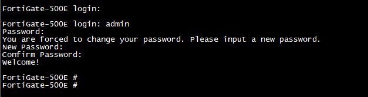
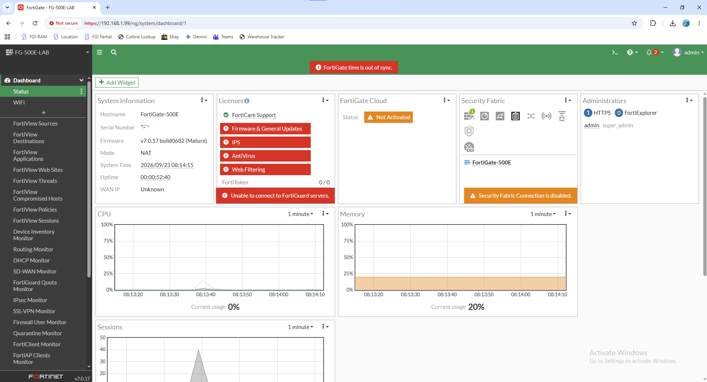
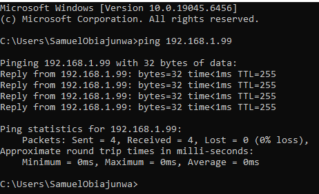
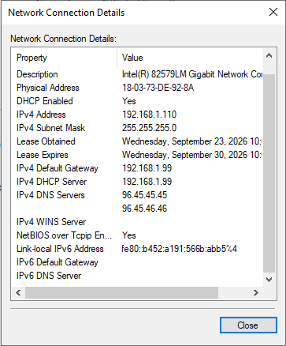
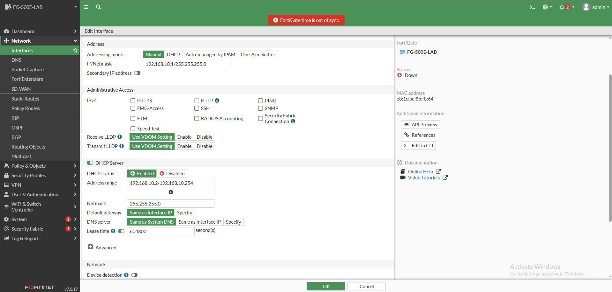
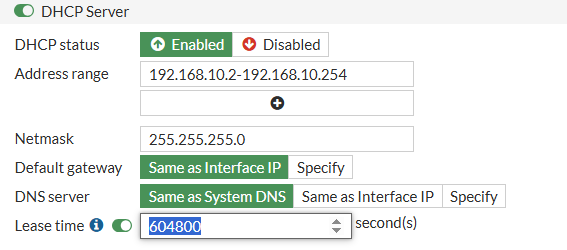
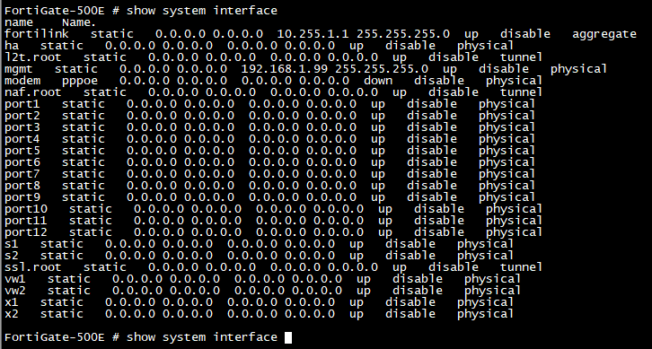
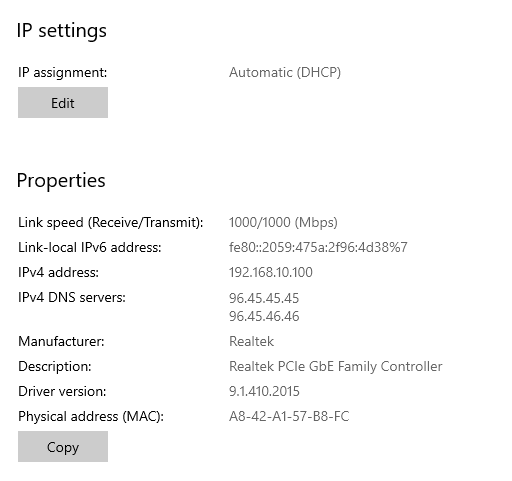
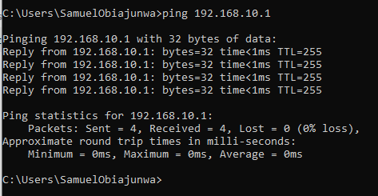
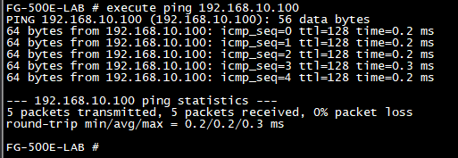

# Enterprise Network Security Lab

Hands-on enterprise network security lab built with a FortiGate 500E firewall and Cisco Catalyst C9200 switch.

This lab documents the deployment, configuration, validation, and troubleshooting of a segmented network security environment. It is built in phases so each step is validated before the next is added.

## Technologies

- FortiGate 500E (FortiOS 7.0.17 build 0682)
- Cisco Catalyst C9200
- Windows 10/11 endpoints
- SecureCRT (serial console)
- Ethernet / IPv4 / DHCP / ICMP
- FortiGate CLI + GUI administration

## Objectives

- [x] Deploy and initialize a FortiGate firewall
- [x] Configure dedicated management access
- [x] Build a LAN interface and DHCP scope
- [x] Integrate a Cisco access switch
- [x] Validate Layer 2 and Layer 3 connectivity
- [x] Investigate firewall policy behavior (implicit deny)
- [ ] Configure WAN interface and default route
- [ ] Create LAN-to-WAN firewall policy with NAT
- [ ] Implement DNS and validate outbound connectivity
- [ ] Add VLAN segmentation
- [ ] Implement security profiles (IPS / AV / Web Filtering)
- [ ] Centralize logging and analyze traffic

## Topology (current phase)

```
              Management Network
              192.168.1.0/24
                     |
        PC NIC 1 ----+---- MGMT
        192.168.1.110   192.168.1.99
                           |
                   +----------------+
                   | FortiGate 500E |
                   |  FortiOS 7.0  |
                   +----------------+
                           |
                     port1 | 192.168.10.1/24
                           |
                     Gi1/0/2
               +------------------+
               |  Cisco Catalyst  |
               |      C9200       |
               +------------------+
                           |
                      Gi1/0/1
                           |
                      PC NIC 2
                   192.168.10.100
              (DHCP from FortiGate)
```

## Completed

### Phase 1 — FortiGate Initialization
- Connected via serial console with SecureCRT
- Logged in as `admin`, completed forced password change
- Verified FortiOS 7.0.17 build 0682, NAT mode, standalone
- Set hostname to `FG-500E-LAB`
- Selected Comprehensive dashboard


*Initial console access and forced admin password change.*


*FortiGate dashboard showing system info, FortiOS version, and resource widgets. Serial number redacted in public version.*

### Phase 2 — Management Network
- Retained dedicated `mgmt` interface: `192.168.1.99/24`
- Enabled administrative access: PING, HTTPS, SSH
- Management PC: `192.168.1.110/24`, gateway `192.168.1.99`
- Verified with `ping 192.168.1.99` — 0% loss


*Management PC to FortiGate management interface — 4/4 replies, 0% loss.*


*Management PC network details showing DHCP-enabled 192.168.1.110.*

### Phase 3 — LAN Deployment
- Configured `port1` as `192.168.10.1/24`
- Enabled DHCP server on `port1`
- Pool: `192.168.10.100` – `192.168.10.200`
- Gateway: `192.168.10.1`, Netmask: `255.255.255.0`, Lease: 604800s
- Verified via CLI: `show system interface`, `show system dhcp server`


*port1 configured as 192.168.10.1/255.255.255.0 with DHCP server enabled.*


*DHCP scope, gateway, DNS, and lease time.*


*CLI verification of interface table — mgmt and port1 up.*

### Phase 4 — Cisco Switching
- Connected FortiGate `port1` to C9200 `Gi1/0/2`
- Connected PC NIC 2 to C9200 `Gi1/0/1`
- Verified `Gi1/0/2`: connected, 1 Gbps, full duplex, access VLAN 1

### Phase 5 — Validation
- Windows endpoint received via DHCP: `192.168.10.100/24`, gateway `192.168.10.1`
- PC → FortiGate: `ping 192.168.10.1` — 0% loss
- FortiGate → PC: `execute ping 192.168.10.100` — 0% loss
- HTTPS GUI reachable via `https://192.168.10.1`
- Routing table shows only directly connected: `192.168.1.0/24` via mgmt, `192.168.10.0/24` via port1 — no default route yet
- Firewall Policy list empty — only implicit deny in effect. This confirms the difference between administrative access to the FortiGate itself vs. traffic forwarded through it.


*Endpoint received 192.168.10.100 from FortiGate DHCP — proves the scope works, not just that it was typed in.*


*PC to FortiGate LAN interface — 4/4 replies.*


*FortiGate to PC — 5/5 replies, 0% loss.*

## Troubleshooting Log

See [docs/troubleshooting.md](docs/troubleshooting.md) for the full log. Highlights:

1. **DHCP pool mismatch** — GUI showed one range, CLI `show system dhcp server` showed another. Used CLI as source of truth and corrected the pool.
2. **ICMP initially failed** — PC had a DHCP address but could not ping `192.168.10.1`. `show system interface port1` showed no `allowaccess` for ping. Added `set allowaccess ping` (alongside https/ssh) and re-tested successfully.

This is the configure → test → inspect → root-cause → remediate → retest loop.

## Skills Demonstrated

- FortiGate CLI and GUI administration
- FortiOS interface and management configuration
- IPv4 subnetting and addressing
- DHCP server configuration and endpoint validation
- Layer 2 switching (Cisco Catalyst access ports, speed/duplex)
- Routing table analysis
- Firewall policy fundamentals and implicit deny behavior
- Administrative access hardening concepts
- Structured network troubleshooting

## Repository Structure

```
enterprise-network-security-lab/
├── README.md
├── docs/
│   ├── architecture.md
│   ├── configuration.md
│   ├── troubleshooting.md
│   └── lessons-learned.md
├── diagrams/
│   └── lab-topology.png
├── screenshots/
├── configs/
│   ├── fortigate/fortigate-sanitized-config.txt
│   └── cisco/cisco-sanitized-config.txt
└── notes/lab-log.md
```

## Sanitization Note

All configs in this repo are sanitized. Before pushing to a public remote, ensure you have removed: admin passwords, private keys, API tokens, VPN PSKs, real public IPs, and serial numbers. The dashboard screenshot in `screenshots/` should have the serial blurred for the public version.
